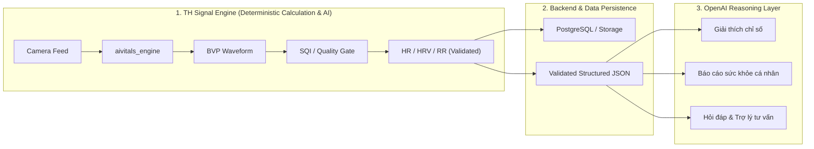

# AIVitals — Non-Contact Physiological Sensing System (rPPG V1)

> **AIVitals** là hệ thống đo lường và theo dõi sinh hiệu y tế không tiếp xúc thời gian thực qua Camera, ứng dụng công nghệ **rPPG (Remote Photoplethysmography)** để trích xuất dạng sóng thể tích xung mạch máu (**BVP - Blood Volume Pulse**) từ vi biến thiên màu sắc mao mạch dưới da mặt, phục vụ ước lượng các chỉ số sinh tồn và đánh giá sức khỏe tim mạch.

---

## 🎯 Mục Tiêu Sản Phẩm (Product Goals)

Xây dựng nền tảng đo sinh hiệu hoàn chỉnh (Web + Real-time Camera) vận hành theo pipeline khép kín:
$$\text{Camera} \longrightarrow \text{Face/ROI} \longrightarrow \text{RGB Buffer} \longrightarrow \text{rPPG} \longrightarrow \text{BVP} \longrightarrow \text{Quality/SQI} \longrightarrow \text{HR/HRV/RR} \longrightarrow \text{Validation} \longrightarrow \text{API/DB/FE}$$

Hệ thống cung cấp các chỉ số sinh tồn cốt lõi:
* **Nhịp tim (Heart Rate - HR)** (BPM)
* **Độ biến thiên nhịp tim (Heart Rate Variability - HRV)** ($SDNN, RMSSD$)
* **Nhịp thở (Respiration Rate - RR)** (Breaths/min)
* **Chỉ số chất lượng tín hiệu (Signal Quality Index - SQI / SNR)**
* **Định hướng mở rộng (Research):** Khảo sát huyết áp (Blood Pressure - BP) và nguy cơ tim mạch dựa trên dữ liệu đối chuẩn y tế có ground-truth.

---

## 🏛️ Ranh Giới Kiến Trúc: Deterministic Signal AI vs. OpenAI

Để đảm bảo độ tin cậy và an toàn y tế, hệ thống phân định ranh giới chức năng tuyệt đối giữa tầng tính toán số liệu và tầng suy luận ngôn ngữ:



* **TH Signal Engine:** Đảm nhận **100% tính toán cốt lõi** mang tính xác định: trích xuất sóng BVP, tính chỉ số chất lượng SQI, lọc dải thông, ước lượng HR/HRV/RR, và kiểm định ngưỡng sinh lý (validation).
* **OpenAI Integration:** **Chỉ nhận dữ liệu JSON đã được validate** để hỗ trợ giải thích kết quả, tổng hợp xu hướng, tạo báo cáo trực quan cho người dùng và giải đáp thắc mắc.
* ⚠️ **Nguyên tắc an toàn bất biến:**
  * OpenAI **không** tính toán tín hiệu rPPG/BVP/HR/HRV/RR.
  * OpenAI **không** tự ý ghi đè hoặc chỉnh sửa dữ liệu đo trong Database.
  * OpenAI **không** đưa ra các tuyên bố chẩn đoán bệnh án y khoa khẳng định (*No medical diagnosis*).

---

## 🏗️ Cấu Trúc Hệ Thống (Monorepo Layout)

Dự án được tổ chức theo mô hình Monorepo phân tách rõ ràng giữa lõi thuật toán xử lý tín hiệu và các dịch vụ ứng dụng:

```text
AIVital/
├── .gitignore                            # Cấu hình Git bỏ qua rác, outputs và weights nặng
├── README.md                             # Trang chủ tổng quan toàn dự án (file này)
│
├── aivitals_engine/                      # 🧠 Lõi xử lý tín hiệu & Thuật toán rPPG (Python)
│   ├── config/                           # Cấu hình tham số sinh lý (FPS, Window, Cutoffs)
│   ├── face/                             # Phát hiện khuôn mặt (OpenCV Cascade & Fallback)
│   ├── roi/                              # Trích xuất vùng da Trán + Má -> Vector RGB
│   ├── signal/                           # Tiền xử lý, lọc Butterworth, Detrending, Resampling
│   ├── rppg/                             # Thuật toán rPPG cốt lõi (POS, CHROM, GREEN)
│   ├── vitals/                           # Ước lượng sinh hiệu (HR FFT/Peak, HRV, RR)
│   ├── quality/                          # Đánh giá chất lượng tín hiệu (Self-supervised SQI / SNR)
│   ├── validation/                       # Kiểm tra tính hợp lệ sinh lý & đánh giá sai số
│   ├── models/                           # Khung giao diện trừu tượng cho Deep Learning Models (V2)
│   ├── samples/                          # Dữ liệu mẫu kiểm thử (.mp4, .csv)
│   ├── outputs/                          # Thư mục lưu kết quả kiểm thử (.gitkeep)
│   ├── scripts/                          # 🚀 Script kiểm thử & mô phỏng luồng camera thời gian thực
│   │   ├── run_signal_pipeline.py        # Runner kiểm thử Signal Pipeline (Face/ROI -> BVP + SQI)
│   │   └── README.md                     # Hướng dẫn chi tiết & link tải dataset
│   ├── pipeline.py                       # Pipeline điều phối & Data Contract BVPStreamPacket
│   ├── signal_pipeline_realtime.py       # Pipeline thời gian thực: Frame -> Face -> ROI -> Buffer -> BVP
│   ├── main.py                           # CLI Test Runner (Batch mode)
│   ├── requirements.txt                  # Dependencies nhẹ cho CPU (< 150 MB)
│   ├── README.md                         # Hướng dẫn chi tiết cho Engine
│   └── SOURCE_AUDIT.md                   # Báo cáo kỹ thuật kiểm tra mã nguồn rPPG
│
├── tests/                                # 🧪 Bộ kiểm thử tự động (Unit & Integration tests)
├── backend/                              # ⚙️ Dịch vụ API, WebSocket & Cơ sở dữ liệu
└── frontend/                             # 🖥️ Giao diện Web Dashboard đo sinh hiệu thời gian thực
```

---

## 📚 Tài Liệu Kỹ Thuật Chuyên Sâu

* 📑 **Báo cáo Khảo sát & Đánh giá Mã nguồn rPPG:** Xem chi tiết tại [**`aivitals_engine/SOURCE_AUDIT.md`**](aivitals_engine/SOURCE_AUDIT.md) — Bản phân tích chuyên sâu 17 thuật toán (Unsupervised & Deep Models), đặc tả I/O và các bẫy kỹ thuật.
* 📦 **Hướng dẫn Cài đặt & Chạy Module Engine:** Xem tại [**`aivitals_engine/README.md`**](aivitals_engine/README.md) — Chi tiết 9 modules, cấu hình tham số và hướng dẫn chạy test runner CLI.
* 🎥 **Kiểm Thử Luồng Camera Thời Gian Thực & Link Dataset:** Xem tại [**`aivitals_engine/scripts/README.md`**](aivitals_engine/scripts/README.md) — Hướng dẫn tải video test từ Google Drive và chạy so sánh 3 phương pháp rPPG (GREEN, CHROM, POS).

---

## 🎯 Tiêu Chuẩn Hoàn Thành (Definition of Done — DoD)

1. Luồng Camera xin quyền mượt mà, định vị khuôn mặt và bám vết ROI ổn định.
2. Sóng xung huyết mạch BVP trích xuất ổn định trong thời gian thực.
3. Các chỉ số HR, HRV, RR chỉ hiển thị khi chất lượng tín hiệu (SQI / Confidence) đạt chuẩn; tự động từ chối (reject) và cảnh báo khi cử động hoặc thiếu sáng.
4. Mọi kết quả đo lưu trữ an toàn trong Database, truy vết được phiên bản thuật toán/mô hình (`algorithm_version`, `model_checksum`).
5. Hoàn thiện API Documentation, Database Migrations, container Docker và giám sát logging.
6. Hồ sơ dữ liệu đối chuẩn (Ground-Truth Dataset) và báo cáo kiểm định lâm sàng được tài liệu hóa đầy đủ.

---

## ⚠️ Tuyên Bố Miễn Trừ Trách Nhiệm Y Tế (Medical Disclaimer)

* AIVitals V1 được phát triển phục vụ mục đích **trình diễn công nghệ, nghiên cứu khoa học, chăm sóc sức khỏe chủ động (wellness) và hỗ trợ sàng lọc ban đầu**.
* Các chỉ số đo đạc từ hệ thống **KHÔNG mặc định được sử dụng làm chẩn đoán y khoa độc lập** hoặc thay thế cho các thiết bị y tế chuyên dụng được cấp phép cũng như kết luận của bác sĩ/chuyên gia y tế.
