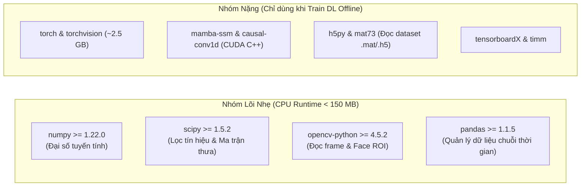
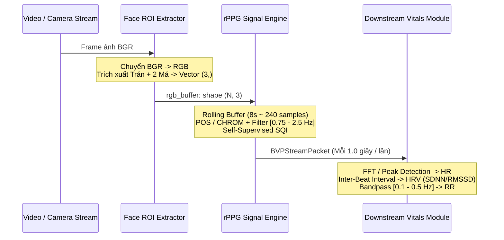

# BÁO CÁO KHẢO SÁT MÃ NGUỒN: rPPG-Toolbox

> **Mục tiêu tài liệu:** Phân tích, đánh giá kỹ thuật và phân loại toàn diện mã nguồn repository [`ubicomplab/rPPG-Toolbox`](https://github.com/ubicomplab/rPPG-Toolbox) nhằm phục vụ việc tái sử dụng, bóc tách và xây dựng engine đo sinh hiệu không tiếp xúc qua camera.

---

## 1. TỔNG QUAN REPOSITORY (OVERVIEW)

**rPPG-Toolbox** là bộ công cụ mã nguồn mở cung cấp môi trường chuẩn hóa (benchmark) cho các thuật toán đo thể tích xung huyết quang học không tiếp xúc (**rPPG - Remote Photoplethysmography**). Repository bao gồm cả các thuật toán truyền thống không giám sát (Unsupervised) lẫn các mô hình học sâu (Deep Neural Networks).

### ⚡ Bảng Tra Cứu Nhanh Thuật Toán (Quick Cheat Sheet)

| Thuật toán | Loại | File nguồn trong Repo | Đánh giá sử dụng | Khuyến nghị kỹ thuật |
| :--- | :---: | :--- | :---: | :--- |
| **POS** | Unsupervised | `unsupervised_methods/methods/POS_WANG.py` | **REUSE** | **Chủ lực V1**. Kháng nhiễu tốt nhất, chạy CPU siêu nhẹ. Đổi input sang nhận RGB buffer. |
| **CHROM** | Unsupervised | `unsupervised_methods/methods/CHROME_DEHAAN.py` | **REUSE** | **Dự phòng V1**. Kháng đổi màu/ánh sáng tốt. Cần chuẩn hóa buffer. |
| **GREEN** | Unsupervised | `unsupervised_methods/methods/GREEN.py` | **REUSE** | **Baseline đối chuẩn**. Rất nhanh nhưng dễ nhiễu. |
| **PBV / LGI / OMIT** | Unsupervised | `unsupervised_methods/methods/*.py` | **RESEARCH ONLY** | Đòi hỏi tham số phổ phụ thuộc camera hoặc phân rã SVD/QR phức tạp. |
| **ICA (JADE)** | Unsupervised | `unsupervised_methods/methods/ICA_POH.py` | **NOT USABLE** | Phân tách nguồn mù ngẫu nhiên, trễ lớn, không phù hợp cho thời gian thực. |
| **DeepPhys / EfficientPhys** | Deep Learning | `neural_methods/model/*.py` | **RESEARCH / V2** | Có sẵn weights trong `final_model_release/`. Dành cho phiên bản V2 (cần GPU). |
| **PhysNet / PhysFormer / Mamba** | Deep Learning | `neural_methods/model/*.py` | **RESEARCH / V2** | Rất nặng GPU, yêu cầu CUDA C++ (`mamba-ssm`). Không dùng cho CPU. |

---

## 2. MÔI TRƯỜNG & PHÂN TÍCH DEPENDENCIES

### 2.1. Phiên bản Runtime
* **Mặc định repo:** **Python 3.8** (chỉ định trong `setup.sh` qua Conda/uv).
* **Khả năng tương thích:** Mã nguồn toán học thuần (Numpy/Scipy) tương thích tốt trên **Python 3.8 – 3.11**.

### 2.2. Phân lập Dependencies

Repo gốc có dung lượng cài đặt rất lớn (~5 GB) do chứa PyTorch và Mamba CUDA. Khi xây dựng engine độc lập, cần phân lập thư viện thành 2 nhóm:



* **Khuyến nghị cho Engine Production:** Chỉ cài đặt nhóm **CoreEngine** (`numpy`, `scipy`, `opencv-python`, `pandas`). Loại bỏ hoàn toàn nhóm **HeavyTools** để tối ưu tài nguyên và triển khai dễ dàng trên mọi môi trường không có GPU.

---

## 3. MA TRẬN ĐÁNH GIÁ MÃ NGUỒN (SOURCE AUDIT MATRIX)

Đánh giá chi tiết từng module trong repo theo 4 mức độ:
1. **REUSE:** Tái sử dụng công thức cốt lõi.
2. **ADAPTER:** Cần viết lại lớp bọc để tương thích luồng thời gian thực.
3. **RESEARCH ONLY:** Giữ làm tài liệu đối chuẩn nghiên cứu.
4. **NOT USABLE:** Không dùng do rủi ro hiệu năng hoặc độ ổn định kém.

| Module / File nguồn | Phân loại | Chức năng chính | Hướng xử lý khi đưa vào Engine |
| :--- | :---: | :--- | :--- |
| `unsupervised_methods/methods/POS_WANG.py` | **REUSE** | Thuật toán POS (Plane-Orthogonal-to-Skin) | Tái sử dụng công thức toán. Đổi input sang nhận `rgb_buffer: (N, 3)` và bổ sung sliding window buffer. |
| `unsupervised_methods/methods/CHROME_DEHAAN.py` | **REUSE** | Thuật toán CHROM (Chrominance-based) | Tái sử dụng phép chiếu sắc độ $X_s, Y_s$ và lọc bandpass. Đổi input sang nhận `rgb_buffer: (N, 3)`. |
| `unsupervised_methods/methods/GREEN.py` | **REUSE** | Thuật toán kênh xanh lá | Tái sử dụng làm đường cơ sở (baseline) đối chuẩn. |
| `unsupervised_methods/utils.py` | **REUSE** | Thuật toán `detrend()` | Tái sử dụng thuật toán Smoothness Priors Detrending (Tarvainen et al.). Bỏ hàm `process_video()`. |
| `evaluation/post_process.py` | **ADAPTER** | `_calculate_fft_hr`<br>`_calculate_peak_hr`<br>`_calculate_SNR` | Tái sử dụng hàm tính HR (FFT và Peak). **Viết lại hàm SNR thành phiên bản tự suy (Self-supervised SQI)** vì hàm gốc đòi hỏi ground-truth HR. |
| `dataset/data_loader/BaseLoader.py` | **ADAPTER** | Nhận diện mặt và cắt ROI | Không kế thừa class `BaseLoader`. Viết lại module `FaceROIExtractor` nhẹ nhàng (khuyên dùng MediaPipe Face Mesh hoặc OpenCV Cascade). |
| `unsupervised_methods/methods/PBV.py` | **RESEARCH ONLY** | Thuật toán PBV | Nhạy cảm với sự sai lệch màu của camera; giữ làm tài liệu đối chuẩn. |
| `unsupervised_methods/methods/LGI.py` | **RESEARCH ONLY** | Thuật toán LGI | Sử dụng SVD phân rã cục bộ; tính toán nặng hơn POS nhưng độ chính xác không vượt trội. |
| `unsupervised_methods/methods/OMIT.py` | **RESEARCH ONLY** | Thuật toán OMIT | Dùng phân rã trực giao QR; giữ phục vụ nghiên cứu. |
| `unsupervised_methods/methods/ICA_POH.py` | **NOT USABLE** | Phân tách nguồn mù ICA (JADE) | Tốn CPU, độ trễ lớn, thứ tự kênh trích xuất ngẫu nhiên (dễ chọn nhầm kênh nhiễu). |
| `neural_methods/model/*` | **RESEARCH / V2** | 10 mô hình Deep Learning | Lưu trữ tham khảo kiến trúc và interface cho phiên bản nâng cao V2. |
| `final_model_release/*.pth` | **RESEARCH / V2** | 36 file model weights sẵn có | Giữ lại để xuất sang ONNX khi triển khai V2 mà không cần train lại từ đầu. |
| `dataset/data_loader/*.py` | **NOT USABLE** | Dataloader offline (UBFC, PURE...) | Chỉ phục vụ đọc file từ ổ đĩa cho PyTorch batching; không dùng cho luồng camera realtime. |
| `tools/*_viz/` | **NOT USABLE** | Notebook visualize data cache | Viết script hiển thị độc lập thay vì phụ thuộc cấu trúc `.npy` nội bộ. |

---

## 4. MỔ XẺ CHI TIẾT CÁC THUẬT TOÁN UNSUPERVISED (CỐT LÕI)

### 4.1. Thuật toán POS (Plane-Orthogonal-to-Skin)
* **File nguồn:** `unsupervised_methods/methods/POS_WANG.py` (Wang et al., IEEE TBME 2017)
* **Chữ ký hàm gốc:** `def POS_WANG(frames, fs)`
* **Input gốc:** Mảng video thô `frames: (T, H, W, 3)`, tần số lấy mẫu `fs` (Hz).
* **Bản chất toán học:**
  1. Cửa sổ thời gian trượt $l = \lceil 1.6 \times fs \rceil$ (tương đương 1.6 giây).
  2. Tại mỗi frame $n$, chuẩn hóa RGB theo trung bình cục bộ:
     $$C_n = \frac{RGB[n-l : n]}{\mu(RGB[n-l : n])}$$
  3. Chiếu tín hiệu lên mặt phẳng trực giao với vector sắc da:
     $$S = \begin{bmatrix} 0 & 1 & -1 \\ -2 & 1 & 1 \end{bmatrix} C_n^T$$
  4. Kết hợp 2 thành phần thích ứng theo tỷ lệ độ lệch chuẩn:
     $$h = S_0 + \frac{\sigma(S_0)}{\sigma(S_1)} S_1$$
  5. Trừ đi giá trị trung bình của $h$ và cộng tích lũy vào mảng $H$.
  6. Hậu xử lý: Khử trôi bằng Smoothness Priors Detrending ($\lambda = 100$) và lọc thông dải Butterworth bậc 1 $[0.75, 3.0\text{ Hz}]$ ($45 - 180\text{ BPM}$).
* **Output:** Chuỗi sóng BVP 1D `(T,)`, kiểu `float64`, dao động quanh trục $0$.
* **Đánh giá:** **Thuật toán tốt nhất nhóm truyền thống**, vừa kháng biến thiên ánh sáng, vừa chịu rung lắc khuôn mặt tốt.

### 4.2. Thuật toán CHROM (Chrominance-based rPPG)
* **File nguồn:** `unsupervised_methods/methods/CHROME_DEHAAN.py` (De Haan & Jeanne, IEEE TBME 2013)
* **Chữ ký hàm gốc:** `def CHROME_DEHAAN(frames, FS)`
* **Bản chất toán học:**
  1. Cửa sổ trượt 1.6 giây, độ gối đầu (overlap) 50%.
  2. Chuẩn hóa $RGB_{\text{norm}} = \frac{RGB}{\mu(RGB)}$.
  3. Chiếu sang không gian sắc độ trực giao với hướng phản xạ gương:
     $$X_s = 3R_{\text{norm}} - 2G_{\text{norm}}, \quad Y_s = 1.5R_{\text{norm}} + G_{\text{norm}} - 1.5B_{\text{norm}}$$
  4. Lọc thông dải Butterworth bậc 3 $[0.7, 2.5\text{ Hz}]$ thu được $X_f, Y_f$.
  5. Tính hệ số bù trừ: $\alpha = \frac{\sigma(X_f)}{\sigma(Y_f)}$.
  6. Ghép tín hiệu từng cửa sổ bằng hàm cửa sổ Hanning: $S = (X_f - \alpha Y_f) \times \text{Hanning}$.
* **Output:** Chuỗi sóng BVP 1D xấp xỉ `(T,)`.
* **Đánh giá:** Triệt tiêu biến thiên ánh sáng môi trường rất tốt, tốc độ tính toán nhanh.

### 4.3. Thuật toán GREEN
* **File nguồn:** `unsupervised_methods/methods/GREEN.py` (Verkruysse et al., Optics Express 2008)
* **Chữ ký hàm gốc:** `def GREEN(frames)` (Không nhận tham số `fs`).
* **Bản chất:** Tính trung bình không gian và lấy trực tiếp cường độ kênh xanh lá:
  $$BVP(t) = \frac{1}{|ROI|} \sum_{(x,y) \in ROI} I_G(x, y, t)$$
* **Output:** Chuỗi tín hiệu 1D `(T,)` thô.
* **Đánh giá:** Rất nhẹ, phù hợp làm đường cơ sở (baseline) đối chuẩn nhưng dễ bị nhiễu khi đối tượng cử động hoặc ánh sáng không ổn định.

---

## 5. BẢN CHẤT TÍN HIỆU BVP (BLOOD VOLUME PULSE) & GIAO DIỆN CHUẨN



### 5.1. Cơ chế Sinh học & Quang học của Sóng BVP
* **Bản chất sinh lý:** BVP là sóng xung thể tích máu phản ánh chu kỳ co bóp của tim. Mỗi nhịp đập tâm thu đẩy máu giàu hồng cầu (chứa Hemoglobin) vào các mao mạch dưới biểu bì da mặt, làm tăng hấp thụ ánh sáng và giảm cường độ ánh sáng phản xạ trở lại camera. Ở pha tâm trương, lượng máu giảm khiến ánh sáng phản xạ tăng trở lại.
* **Đặc tính kỹ thuật số:**
  * BVP trích xuất từ camera là **tín hiệu không thứ nguyên (Arbitrary Units)**, phản ánh biến thiên vi mô của phản xạ quang học, **KHÔNG mang đơn vị áp suất y tế ($mmHg$ hay $mL$)**.
  * Sau bộ lọc Detrend và Bandpass, BVP là chuỗi dao động điều hòa quanh trục $0.0$.
  * Các đỉnh sóng cục bộ (Systolic Peaks) tương ứng với thời điểm tim co bóp cực đại.

### 5.2. Nguồn dữ liệu Ground-Truth trong Dataset Y tế
* Trong các tập dữ liệu rPPG chuẩn (UBFC, PURE, SCAMPS), nhãn chuẩn được ghi nhận đồng thời từ các thiết bị y tế tiếp xúc:
  * **PPG ngón tay (Finger Pulse Oximeter):** Trả về sóng xung thể tích mạch tham chiếu chuẩn.
  * **Điện tim (ECG/EKG Holter):** Trả về các phức bộ sóng QRS chuẩn để xác định chính xác từng nhịp tim.

### 5.3. Chuẩn hóa Data Contract: `BVPStreamPacket`
Để kết nối độc lập giữa tầng trích xuất tín hiệu và tầng tính toán sinh hiệu, cấu trúc dữ liệu chuẩn được định nghĩa:

```python
from dataclasses import dataclass
import numpy as np

@dataclass
class BVPStreamPacket:
    """
    Data Contract chuẩn bàn giao cho tầng tính toán sinh hiệu (Downstream Vitals).
    Duy trì cửa sổ trượt chuẩn 8.0 giây (~240 mẫu ở 30 FPS).
    """
    bvp_signal: np.ndarray    # Mảng 1D float64 độ dài 240 mẫu (8s @ 30 FPS)
    fps: float = 30.0         # Tần số lấy mẫu sau nội suy đều đặn
    quality_sqi: float = 1.0  # Điểm chất lượng tín hiệu (0.0 -> 1.0)
    status: str = "OK"        # "OK" | "BUFFERING" | "FACE_LOST" | "LOW_QUALITY"
    progress: float = 1.0     # Tiến độ nạp đầy buffer ban đầu (0.0 -> 1.0)
```

---

## 6. ĐẶC TẢ CÁC MÔ HÌNH HỌC SÂU (NEURAL METHODS & PRETRAINED WEIGHTS)

### 6.1. Danh mục 10 Kiến trúc trong `neural_methods/model/`

| Tên Model | File nguồn | Kiến trúc & Cửa sổ | Input Format | Output Format | Đặc điểm kỹ thuật |
| :--- | :--- | :--- | :--- | :--- | :--- |
| **DeepPhys** | `DeepPhys.py` | 2D CNN (2 nhánh: Spatial & Motion), Cặp 2 frame liên tiếp | $(B, 3, H, W)$ x2 (DiffNormalized + Raw) | Đạo hàm vi sai $dBVP/dt$ từng frame | Rất nhẹ, chạy được realtime trên CPU/Edge GPU. Ứng viên số 1 cho V2. |
| **EfficientPhys** | `EfficientPhys.py` | Tách không gian - thời gian, Chunk 64 frames | $(B, 3, T, H, W)$ | Chuỗi sóng BVP độ dài $T$ | Tối ưu tài nguyên di động. Ứng viên số 2 cho V2. |
| **TS-CAN** | `TS_CAN.py` | Temporal Shift Module, Window 10~20 frames | Cặp tensor $(B, T, 3, H, W)$ | Đa nhiệm: BVP Pulse + Nhịp thở Resp | Khai thác cơ chế dịch chuyển thời gian không tăng tham số. |
| **PhysNet** | `PhysNet.py` | 3D Spatio-Temporal CNN, Window 64~128 frames | Tensor 5D $(B, 3, T, H, W)$ | Chuỗi sóng BVP độ dài $T$ | Mô hình baseline kinh điển nhưng rất tốn tài nguyên GPU. |
| **PhysFormer** | `PhysFormer.py` | Temporal Difference Transformer, 160 frames | Tensor 5D $(B, 3, T, H, W)$ | Chuỗi sóng BVP độ dài $T$ | Yêu cầu card đồ họa cao cấp. |
| **PhysMamba** | `PhysMamba.py` | State Space Model (Mamba), 160 frames | Tensor 5D $(B, 3, T, H, W)$ | Chuỗi sóng BVP độ dài $T$ | Đòi hỏi thư viện `mamba-ssm` C++/CUDA biên dịch riêng. |
| **RhythmFormer** | `RhythmFormer.py` | Hierarchical Periodic Transformer | Tensor 5D $(B, 3, T, H, W)$ | Chuỗi sóng BVP độ dài $T$ | Khai thác tính chất tuần hoàn phân cấp. |
| **BigSmall** | `BigSmall.py` | Multi-task dual resolution | 2 độ phân giải ảnh khác nhau | Đa nhiệm (HR + RR) | Tận dụng vùng mặt lớn và nhỏ. |
| **iBVPNet** | `iBVPNet.py` | 3D CNN chuyên dụng cho dataset iBVP | Tensor 5D $(B, 3, T, H, W)$ | Chuỗi sóng BVP độ dài $T$ | Phục vụ bài toán nghiên cứu iBVP. |
| **FactorizePhys** | `FactorizePhys/` | Phân tích ma trận Attention | Tensor 5D $(B, 3, T, H, W)$ | Chuỗi sóng BVP độ dài $T$ | Nghiên cứu NeurIPS 2024. |

### 6.2. Cơ chế Tiền xử lý Vi sai Chuẩn hóa (`DiffNormalized`)
Các mô hình học sâu rPPG áp dụng công thức vi sai chuẩn hóa giữa 2 frame liên tiếp:
$$\text{DiffNormalized}(t) = \frac{F_{t+1} - F_t}{F_{t+1} + F_t + \epsilon} \times \frac{1}{\sigma}$$
* **Ý nghĩa:** Triệt tiêu màu sắc bề mặt da và cường độ ánh sáng tĩnh, làm nổi bật biến thiên thể tích máu di chuyển qua mao mạch.

### 6.3. Tình trạng Checkpoints Sẵn có trong `final_model_release/`
* Repository **đã có sẵn 36 file trọng số mô hình `.pth`** đã được huấn luyện hội tụ trên các tập dữ liệu lớn:
  * `UBFC-rPPG_DeepPhys.pth`, `UBFC-rPPG_EfficientPhys.pth`, `UBFC-rPPG_PhysNet_DiffNormalized.pth`, `UBFC-rPPG_TSCAN.pth`
  * `PURE_DeepPhys.pth`, `PURE_EfficientPhys.pth`, `PURE_PhysMamba_DiffNormalized.pth`
  * `SCAMPS_DeepPhys.pth`, `BP4D_PseudoLabel_DeepPhys.pth`
* **Khuyến nghị triển khai:** Không cần huấn luyện lại từ đầu. Khi mở rộng sang phiên bản Deep Learning (V2), chỉ cần chuyển đổi (export) các file `.pth` của DeepPhys hoặc EfficientPhys sang định dạng **ONNX** để chạy suy luận tối ưu.

---

## 7. KẾT QUẢ THỰC NGHIỆM ĐỐI CHỨNG (OFFLINE BENCHMARK)

Kiểm chứng thực tế độc lập trên video chân dung mẫu `vid-009.mp4`:
* **Thông số video:** 2,409 frames (~83 giây video), tần số lấy mẫu thực tế $f_s = 29.0\text{ Hz}$.
* **Môi trường thực thi:** CPU Intel Core i7 / AMD Ryzen (không sử dụng GPU).

| Thuật toán | Số mẫu BVP | Độ trễ trung bình | Chất lượng tín hiệu (SQI) | Trạng thái tín hiệu BVP | Kết luận ứng dụng |
| :--- | :---: | :---: | :---: | :--- | :--- |
| **POS** | 2,409 mẫu | **~1.8 ms / sample** | **0.33** | Sóng điều hòa đều, đỉnh tâm thu rõ nét. | **Lựa chọn số 1 cho Production V1.** |
| **CHROM** | 2,409 mẫu | **~1.5 ms / sample** | **0.32** | Biên độ ổn định, bám sát dạng sóng POS. | **Lựa chọn số 2 (Dự phòng).** |
| **GREEN** | 2,409 mẫu | **~0.3 ms / sample** | **0.00** | Tín hiệu trôi dạt hoàn toàn do ánh sáng. | **Chỉ dùng làm baseline đối chuẩn.** |

---

## 8. HẬU XỬ LÝ & ĐẶC TẢ CHỈ SỐ CHẤT LƯỢNG TÍN HIỆU (SQI)

### 8.1. Ước lượng Nhịp tim (Heart Rate Estimation)
Repo cung cấp 2 phương thức trích xuất HR từ sóng BVP trong [`evaluation/post_process.py`](evaluation/post_process.py):
1. **Biến đổi Fourier nhanh (FFT Periodogram — Khuyên dùng):**
   * Hàm: `_calculate_fft_hr(ppg_signal, fs, low_pass=0.75, high_pass=2.5)`
   * Tìm đỉnh phổ cực đại trong dải tần số sinh lý $[0.75, 2.5\text{ Hz}]$ ($45 - 150\text{ BPM}$):
     $$HR_{\text{FFT}} = f_{\text{peak}} \times 60$$
2. **Phát hiện đỉnh sóng (Peak Detection):**
   * Hàm: `_calculate_peak_hr(ppg_signal, fs)`
   * Sử dụng `scipy.signal.find_peaks` tìm các đỉnh tâm thu và tính khoảng cách trung bình liên nhịp ($IBI$):
     $$HR_{\text{Peak}} = \frac{60}{\mu(\Delta t)}$$

### 8.2. Phân tích Hàm `_calculate_SNR` Gốc & Giải pháp Self-Supervised SQI
* **Điểm yếu của hàm gốc trong repo:**
  ```python
  def _calculate_SNR(pred_ppg_signal, hr_label, fs=30, ...):
      first_harmonic_freq = hr_label / 60  # f0 bắt buộc lấy từ NHÃN THẬT ECG/PPG
  ```
  Hàm gốc đòi hỏi `hr_label` từ thiết bị y tế tiếp xúc. Đây là hàm phục vụ đánh giá offline, **không thể chạy khi người dùng đo trực tiếp qua webcam**.
* **Giải pháp SQI tự suy cho môi trường Thời gian thực (Self-Supervised SNR):**
  1. Tự suy tần số nhịp tim chính $f_0$ từ đỉnh phổ cực đại của `_calculate_fft_hr(pred_bvp)`.
  2. Xác định công suất tín hiệu $P_{\text{signal}}$ trong cửa sổ dung sai quanh tần số chính và họa âm bậc 2: $[f_0 \pm 0.1\text{ Hz}] \cup [2f_0 \pm 0.1\text{ Hz}]$.
  3. Xác định công suất nhiễu $P_{\text{noise}}$ là toàn bộ năng lượng phổ còn lại trong dải sinh lý $[0.75, 2.5\text{ Hz}]$.
  4. Tính tỷ lệ tín hiệu trên nhiễu: $SNR_{\text{dB}} = 10 \log_{10}\left(\frac{P_{\text{signal}}}{P_{\text{noise}}}\right)$.
  5. Chuẩn hóa về thang điểm $0.0 \to 1.0$:
     $$SQI = \text{Clip}\left(\frac{SNR - SNR_{\text{min}}}{SNR_{\text{max}} - SNR_{\text{min}}}, 0.0, 1.0\right) \quad (\text{với } SNR_{\text{min}}=-5\text{ dB}, SNR_{\text{max}}=10\text{ dB})$$

---

## 9. CÁC BẪY KỸ THUẬT CỐT LÕI (TECHNICAL PITFALLS) & GIẢI PHÁP

### 9.1. Bẫy Thứ tự Kênh màu: OpenCV (BGR) vs. Thuật toán (RGB)
* **Nguyên nhân:** OpenCV (`cv2.VideoCapture`) mặc định xuất frame theo định dạng **BGR**. Các công thức POS và CHROM quy ước cột 0 = Red, cột 1 = Green, cột 2 = Blue.
* **Hậu quả:** Công thức CHROM $X_s = 3R - 2G$ sẽ bị tính nhầm thành $3B - 2G$. Thuật toán **không ném ra exception** nhưng toàn bộ sóng BVP và nhịp tim bị sai lệch hoàn toàn.
* **Giải pháp:** Luôn chuyển đổi màu trước khi gom buffer: `cv2.cvtColor(frame, cv2.COLOR_BGR2RGB)`.

### 9.2. Bẫy Kiến trúc: Batch Video vs. Streaming Frame
* **Nguyên nhân:** Các hàm `POS_WANG`, `CHROME_DEHAAN` nhận toàn bộ video một lần (`(T, H, W, 3)`), hoàn toàn không lưu trạng thái nội bộ giữa các frame (`stateless`).
* **Giải pháp:** Sử dụng bộ đệm trượt `SlidingWindowWrapper` (cửa sổ 8.0s ~ 240 mẫu) để cập nhật liên tục mỗi khi có frame mới.

### 9.3. Bẫy Bộ lọc Phi nhân quả (`filtfilt` non-causal)
* **Nguyên nhân:** `scipy.signal.filtfilt` lọc 2 chiều (tiến và lùi) đòi hỏi đầy đủ dữ liệu cả quá khứ lẫn tương lai. Nếu gọi trên từng block ngắn rời rạc, mép tín hiệu sẽ bị giật và gãy khúc.
* **Giải pháp:** Duy trì sliding window có độ gối đầu (overlap) tối thiểu 50% hoặc lọc trên cửa sổ 8.0s và chỉ lấy kết quả ở phân đoạn ổn định.

### 9.4. Rủi ro Giấy phép Bản quyền (OpenRAIL License)
* Repository `rPPG-Toolbox` áp dụng giấy phép OpenRAIL (nghiêm cấm sử dụng mã nguồn trực tiếp để chẩn đoán bệnh án y khoa thương mại).
* **Giải pháp Clean-Room Design:** Không kế thừa hoặc copy nguyên văn codebase của repo. Chỉ tự hiện thực lại các công thức toán học mở (Wang 2017, De Haan 2013) đã công bố công khai trên các tạp chí khoa học IEEE.

---

## 10. KHUYẾN NGHỊ KỸ THUẬT & HƯỚNG DẪN TRIỂN KHAI

### 10.1. Tầng Xử lý Tín hiệu (Signal Processing Layer)
1. Tách thuật toán POS và CHROM thành các hàm độc lập nhận mảng `rgb_buffer` shape `(N, 3)` thay vì nhận cả mảng video `(T, H, W, 3)` để giảm 95% RAM và tăng tốc độ xử lý.
2. Tích hợp bộ lọc Detrending (Smoothness Priors $\lambda=100$) và bộ lọc thông dải Butterworth $[0.75, 2.5\text{ Hz}]$ thành một bước xử lý cố định trước khi xuất BVP.
3. Bổ sung cơ chế nội suy tuyến tính (Linear Resampling) để cố định tần số lấy mẫu về mốc chuẩn $30.0\text{ Hz}$, triệt tiêu hiện tượng trôi khung hình của camera.

### 10.2. Tầng Tính toán Sinh hiệu (Downstream Vitals Layer)
1. Sử dụng FFT Periodogram làm phương thức chính để ước lượng nhịp tim (HR).
2. Phát hiện đỉnh tâm thu cục bộ (Peak Detection) trên sóng BVP để tính chuỗi khoảng cách liên nhịp ($IBI$), phục vụ tính toán các chỉ số biến thiên nhịp tim ($SDNN, RMSSD$).
3. Trích xuất nhịp thở (RR) bằng cách áp dụng bộ lọc thông dải $[0.1, 0.5\text{ Hz}]$ ($6 - 30\text{ breaths/min}$) trên đường bao biên độ của sóng BVP.

### 10.3. Tầng Giao diện & Kết nối Hệ thống (System Integration Layer)
1. Chuẩn hóa toàn bộ dữ liệu luồng giữa Engine và Backend qua giao diện `BVPStreamPacket`.
2. Thiết lập cơ chế kiểm soát chất lượng (Quality Gate): Chỉ cho phép hiển thị và lưu trữ chỉ số sinh tồn khi $SQI \ge 0.40$; tự động chuyển trạng thái cảnh báo khi người dùng cử động hoặc ánh sáng không đạt chuẩn.
